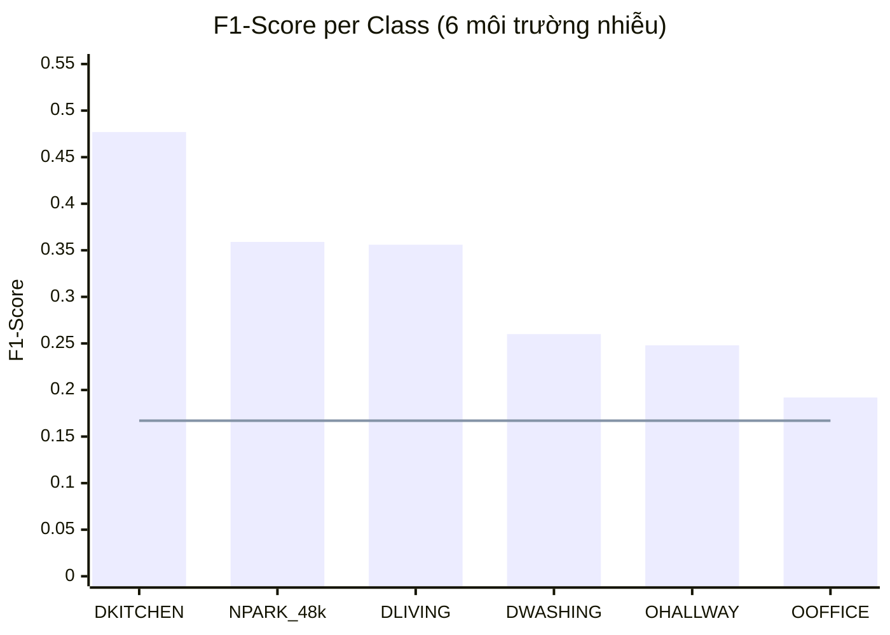
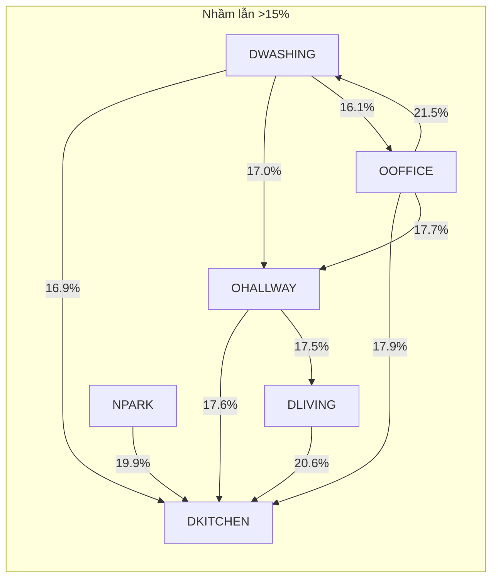

# Báo cáo kết quả — Phân loại môi trường nhiễu trên dữ liệu Audio thực

## 1. Tổng quan thí nghiệm

### Mục tiêu
Đánh giá khả năng **phân loại 6 loại môi trường nhiễu** trong tín hiệu audio thực bằng **18 complexity metrics** kết hợp **CatBoost Classifier**.

### Cấu hình thí nghiệm

| Tham số | Giá trị |
|---------|---------|
| **Dữ liệu** | File WAV audio thực tế từ `dataset_out` |
| **Bài toán** | Task 1: Phân loại loại nhiễu (6-class) |
| **Số classes** | 6 môi trường: DKITCHEN, DLIVING, DWASHING, NPARK\_48k, OHALLWAY, OOFFICE |
| **Tổng file audio** | 4,200 file WAV (train: 3,000 / val: 600 / test: 600) |
| **Số signal\_id (speech sources)** | 2,755 |
| **Tổng mẫu ML (rolling windows)** | 1,339,800 |
| **Số features** | 18 complexity metrics |
| **Window size** | 300 samples |
| **Window stride** | 300 samples |
| **Mô hình** | CatBoostClassifier (out-of-the-box, không tuning) |
| **Đánh giá** | 50 repeated group-aware train/test splits (theo `signal_id`) |
| **Test size** | 20% |
| **Balancing** | Có (downsample về minority class) |
| **SNR** | Phân bố liên tục 30–40 dB (982 mức khác nhau) |

### 18 Complexity Features

| Nhóm | Features |
|------|----------|
| **Statistical** | `std_dev`, `mad`, `cv` |
| **Derivative (embedding)** | `var1der`, `var2der` |
| **Entropy** | `approximate_entropy`, `sample_entropy`, `permutation_entropy`, `lempel_ziv_complexity` |
| **Fractal/Scaling** | `dfa`, `hurst` |
| **Fisher Information** | `fisher_info`, `fisher_info_nk` |
| **SVD/Embedding** | `svd_entropy`, `rel_decay`, `svd_energy`, `condition_number`, `spectral_skewness` |

---

## 2. Kết quả tổng hợp

### Metrics tổng thể (macro average, mean ± std trên 50 splits)

| Metric | Mean | Std | Min | Median | Max |
|--------|:----:|:---:|:---:|:------:|:---:|
| **Accuracy** | 0.3276 | 0.0045 | 0.3167 | 0.3267 | 0.3383 |
| **Precision** | 0.3153 | 0.0043 | 0.3064 | 0.3144 | 0.3250 |
| **Recall** | 0.3276 | 0.0045 | 0.3167 | 0.3267 | 0.3383 |
| **F1** | 0.3152 | 0.0041 | 0.3055 | 0.3143 | 0.3247 |

> [!NOTE]
> Random baseline cho 6 classes = 1/6 ≈ **0.167**. Mô hình đạt accuracy **0.328** — gấp ~2× so với random, cho thấy complexity metrics có nắm bắt được **một phần** thông tin phân biệt giữa các môi trường nhiễu.

> Phương sai rất nhỏ (std ≈ 0.004) qua 50 splits cho thấy kết quả **ổn định**, pipeline đánh giá đáng tin cậy.

---

## 3. Phân tích per-class

### 3.1 Performance theo từng loại môi trường (mean ± std, 50 splits)

| Xếp hạng | Class (Môi trường) | Precision | Recall | F1-Score |
|:---------:|---------------------|:---------:|:------:|:--------:|
| 🥇 1 | **DKITCHEN** (Nhà bếp) | 0.394 ± 0.011 | **0.604 ± 0.018** | **0.477 ± 0.010** |
| 🥈 2 | **NPARK\_48k** (Công viên) | 0.360 ± 0.010 | 0.358 ± 0.018 | 0.359 ± 0.011 |
| 🥉 3 | **DLIVING** (Phòng khách) | 0.346 ± 0.011 | 0.368 ± 0.017 | 0.356 ± 0.008 |
| 4 | **DWASHING** (Máy giặt) | 0.290 ± 0.011 | 0.235 ± 0.008 | 0.260 ± 0.007 |
| 5 | **OHALLWAY** (Hành lang) | 0.253 ± 0.010 | 0.244 ± 0.011 | 0.248 ± 0.007 |
| 6 | **OOFFICE** (Văn phòng) | 0.249 ± 0.010 | **0.156 ± 0.008** | **0.192 ± 0.007** |

> [!IMPORTANT]
> **DKITCHEN** nổi bật hơn hẳn (F1 = 0.48) — nhiễu nhà bếp (tiếng máy rửa bát, quạt hút, nước chảy) tạo ra **đặc trưng complexity khác biệt** nhất so với các môi trường khác.
>
> **OOFFICE** kém nhất (F1 = 0.19, recall = 0.16) — nhiễu văn phòng có đặc trưng tương tự nhiều môi trường indoor khác.

### 3.2 Phân tích nhóm

| Nhóm | Các class | F1 trung bình | Nhận xét |
|------|-----------|:-------------:|----------|
| **Tốt** | DKITCHEN | 0.48 | Đặc trưng rõ ràng, dễ phân biệt |
| **Trung bình** | NPARK\_48k, DLIVING | 0.36 | Phân biệt được ở mức vừa phải |
| **Yếu** | DWASHING, OHALLWAY, OOFFICE | 0.23 | Đặc trưng chồng lấp, khó phân biệt |

---

## 4. Confusion Matrix (Normalized)

Ma trận nhầm lẫn trung bình (chuẩn hóa theo hàng) qua 50 splits:

|  | → DKITCHEN | → DLIVING | → DWASHING | → NPARK | → OHALLWAY | → OOFFICE |
|---|:---:|:---:|:---:|:---:|:---:|:---:|
| **DKITCHEN** | **60.4%** | 11.4% | 5.1% | 9.4% | 8.8% | 4.8% |
| **DLIVING** | 20.6% | **36.8%** | 7.8% | 12.7% | 15.5% | 6.6% |
| **NPARK\_48k** | 19.9% | 14.1% | 9.2% | **35.8%** | 13.1% | 7.9% |
| **DWASHING** | 16.9% | 13.1% | **23.5%** | 13.5% | 17.0% | 16.1% |
| **OHALLWAY** | 17.6% | 17.5% | 14.2% | 14.5% | **24.4%** | 11.9% |
| **OOFFICE** | 17.9% | 13.7% | 21.5% | 13.5% | 17.7% | **15.6%** |

### Phân tích nhầm lẫn chính

> [!WARNING]
> **Hiện tượng bias sang DKITCHEN**: Hầu hết các class bị nhầm sang DKITCHEN với tỷ lệ 17–21%. Mô hình có xu hướng **mặc định predict DKITCHEN** khi không chắc chắn, vì đặc trưng complexity của DKITCHEN "nổi bật" nhất.

**Các cặp nhầm lẫn đáng chú ý:**
- **OOFFICE ↔ DWASHING** (21.5% / 16.1%): Cả hai là indoor noise với tiếng máy → complexity profiles tương tự
- **OHALLWAY ↔ DLIVING** (17.5%): Cả hai là không gian mở trong nhà → đặc trưng acoustic chồng lấp
- **OOFFICE ↔ OHALLWAY** (17.7%): Không gian indoor yên tĩnh → khó phân biệt bằng complexity

---

## 5. Nhận xét và kết luận

### 5.1 Kết luận chính

| # | Kết luận |
|---|----------|
| 1 | 18 complexity metrics **có khả năng phân biệt một phần** giữa các môi trường nhiễu (accuracy gấp ~2× random baseline) |
| 2 | **DKITCHEN** (nhà bếp) được nhận diện tốt nhất — nhiễu bếp có cấu trúc phức tạp đặc thù |
| 3 | Các môi trường indoor yên tĩnh (**OOFFICE, OHALLWAY**) rất khó phân biệt bằng complexity metrics |
| 4 | Kết quả **ổn định** qua 50 splits (std < 0.005), cho thấy pipeline đánh giá đáng tin cậy |
| 5 | Complexity metrics **chưa đủ** để phân loại chính xác 6 môi trường nhiễu thực |

### 5.2 Hạn chế

- **SNR cao (30–40 dB)**: nhiễu rất yếu so với speech, làm giảm khả năng phát hiện đặc trưng nhiễu
- **Chỉ dùng time-domain complexity**: không khai thác đặc trưng frequency-domain vốn rất quan trọng cho phân loại âm thanh
- **Mô hình out-of-the-box**: CatBoost chưa được tuning

### 5.3 Đề xuất cải thiện

> [!TIP]
> **5 hướng cải thiện tiềm năng:**
> 1. **Thêm features miền tần số** — spectral centroid, MFCCs, spectral rolloff, spectral flatness — vì đây là đặc trưng phân biệt chính giữa các môi trường acoustic
> 2. **Giảm window\_stride** (300 → 100) để tăng overlap và số mẫu training
> 3. **Gộp classes** — ví dụ indoor (DKITCHEN+DLIVING+DWASHING+OOFFICE) vs outdoor (NPARK+OHALLWAY) → binary/few-class dễ phân biệt hơn
> 4. **Hyperparameter tuning** cho CatBoost (grid search hoặc Optuna)
> 5. **Feature selection/importance analysis** qua XAI (Step 6) để xác định features nào thực sự hữu ích và loại bỏ features gây nhiễu
